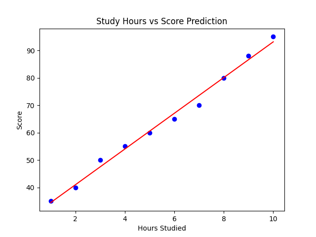

# 🎓 Student Score Prediction using Machine Learning


---

## 📊 Project Overview

This project predicts **student exam scores based on the number of hours studied** using a **Machine Learning model**.

A **Linear Regression algorithm** is used to learn the relationship between study time and exam performance.

The project demonstrates the **end-to-end machine learning workflow**, including data analysis, model training, prediction, and visualization using Python.

---

## ⚙️ Technologies & Libraries

| Technology       | Purpose                               |
| ---------------- | ------------------------------------- |
| **Python**       | Core programming language             |
| **Pandas**       | Data manipulation and analysis        |
| **Matplotlib**   | Data visualization                    |
| **Scikit-learn** | Machine learning model implementation |

---

## 📂 Dataset

The dataset used in this project contains information about **study hours and corresponding exam scores**.

| Hours Studied | Score |
| ------------- | ----- |
| 1             | 35    |
| 2             | 40    |
| 3             | 50    |
| 4             | 55    |
| 5             | 60    |
| 6             | 65    |
| 7             | 70    |
| 8             | 80    |
| 9             | 88    |
| 10            | 95    |

This dataset is used to train a **Linear Regression model** that predicts student scores.

---

## 🤖 Machine Learning Model

The project uses **Linear Regression from Scikit-learn** to build a predictive model.

### Model Workflow

1️⃣ Load dataset using **Pandas**
2️⃣ Separate **input variable (Hours Studied)** and **target variable (Score)**
3️⃣ Train the **Linear Regression model**
4️⃣ Predict exam scores for new study hours
5️⃣ Visualize the regression results using **Matplotlib**

---

## 📈 Model Output

Example prediction generated by the model:

**Predicted Score for 7.5 hours of study:**

```
~76 Marks
```

The model identifies a **positive relationship between study hours and exam performance**.

---

## 📊 Visualization

The project generates a regression visualization showing:

* 🔵 **Actual student scores (data points)**
* 🔴 **Regression prediction line**



---

## 🚀 Skills Demonstrated

This project highlights the following data science skills:

* 📊 Data Analysis
* 🤖 Machine Learning Fundamentals
* 📈 Regression Modeling
* 📉 Data Visualization
* 🐍 Python Programming
* 📊 Predictive Analytics

---

## 📁 Project Structure

```id="gnhqzs"
Student-Score-Prediction-ML
│
├── dataset
│   └── student_scores.csv
│
├── notebook / script
│   └── score_prediction.py
│
├── images
│   └── prediction_graph.png
│
└── README.md
```

---

## 👩‍💻 Author

**Devareddy Mayuri**
📊 Aspiring Data Analyst

**Skills:**
Python • SQL • Excel • Power BI • Machine Learning • Data Visualization

---

⭐ *If you found this project useful, consider giving the repository a star!*
